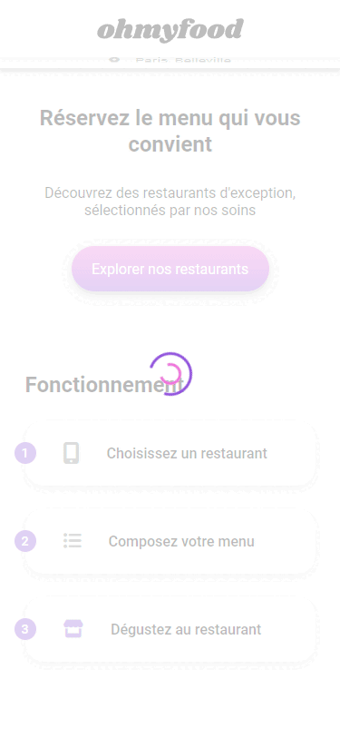
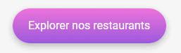
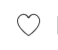
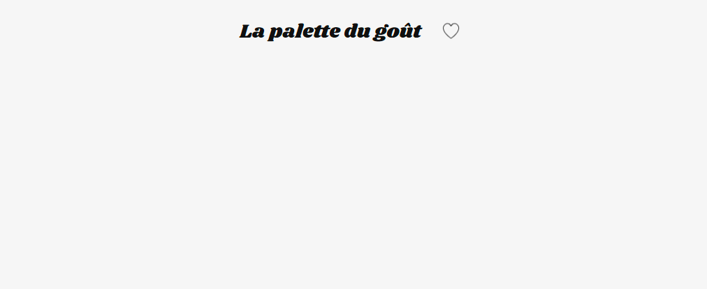
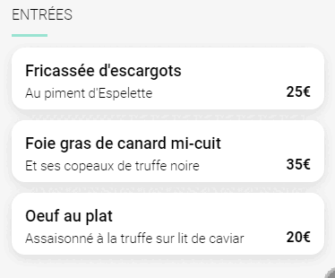

# 🍲 Ohmyfood — Animations CSS Modernes

[](https://developer.mozilla.org/fr/docs/Web/HTML)
[](https://developer.mozilla.org/fr/docs/Web/CSS)
[](https://sass-lang.com/)

> **Ohmyfood** est une interface de réservation de restaurants gastronomiques "mobile-first", développée exclusivement en HTML/CSS avec SASS, sans aucun JavaScript pour les animations.

---

## 📌 Présentation du Projet

Ce projet a été réalisé dans le cadre de ma formation de **Développeur Web**. L'objectif principal était de mettre en œuvre des animations CSS avancées pour améliorer l'expérience utilisateur tout en respectant une approche **Mobile First**.

### 🎯 Objectifs pédagogiques :
- [x] Utiliser SASS pour structurer le code CSS (système de variables, mixins, nesting).
- [x] Implémenter des animations CSS complexes (Loader, effets au survol, apparitions séquentielles).
- [x] Assurer un design responsive cohérent (Mobile, Tablette, Desktop).
- [x] Respecter une maquette graphique rigoureuse via Figma.

---

## ✨ Fonctionnalités & Animations

Le projet met l'accent sur une expérience fluide et "app-like". Voici un aperçu des animations implémentées :

### 🌀 Loading Spinner
Un loader personnalisé s'affiche au chargement de la page d'accueil pour simuler une expérience d'application moderne.
<p align="center">
  
</p>

### 🖱️ Effets de survol
Les boutons d'action disposent d'un effet de gradient et d'ombre portée au survol pour un retour visuel immédiat.
<p align="center">
  
</p>

### ❤️ Système de favoris
Une animation de remplissage progressive avec un dégradé de couleurs pour marquer ses restaurants favoris.
<p align="center">
  
</p>

### 📈 Apparition progressive des menus
Les plats apparaissent avec un léger décalage temporel (effet cascade) lors de l'ouverture d'un menu de restaurant.
<p align="center">
  
</p>

### ✅ Sélection des plats
Un indicateur de validation animé (check) s'affiche lors de la sélection d'un plat dans le menu.
<p align="center">
  
</p>

---

## 🚀 Installation et Utilisation

### Prérequis
- Un navigateur web moderne
- [Node.js](https://nodejs.org/) (si vous souhaitez modifier et recompiler les styles SASS)

### Installation locale
1. Clonez le dépôt :
   ```bash
   git clone https://github.com/AndreaP2A/Ohmyfood.git
   ```
2. Accédez au dossier :
   ```bash
   cd Ohmyfood
   ```
3. Installez les dépendances :
   ```bash
   npm install
   ```
4. Lancez la compilation SASS en mode observation (watch) :
   ```bash
   npm run compile
   ```
5. Ouvrez le fichier `index.html` dans votre navigateur.

---

## 🛠️ Structure du projet

L'organisation des fichiers suit l'architecture **7-1 Pattern** pour une gestion claire du SASS :

```text
.
├── assets/             # Images, fonts et CSS compilé
├── sass/               # Fichiers sources SASS
│   ├── base/           # Reset et typographie de base
│   ├── components/     # Boutons, cartes, loader, etc.
│   ├── layout/         # Header, footer, navigation
│   ├── pages/          # Styles spécifiques à l'accueil et aux menus
│   ├── utils/          # Variables, fonctions et mixins
│   └── main.scss       # Point d'entrée principal
├── src/                # Pages HTML des restaurants
└── index.html          # Page d'accueil
```

---

## 🌐 Aperçu en ligne

Le projet est accessible en ligne via GitHub Pages : 
👉 [Consulter la démo Ohmyfood](https://andreap2a.github.io/P2-Ohmyfood/)

---

## 👨‍💻 Auteur

**Andréa PORCHE**
- GitHub : [@AndreaP2A](https://github.com/AndreaP2A)
- Portfolio : [Découvrir mes autres projets](https://github.com/AndreaP2A)
- Email : andrea.porche2a@gmail.com
